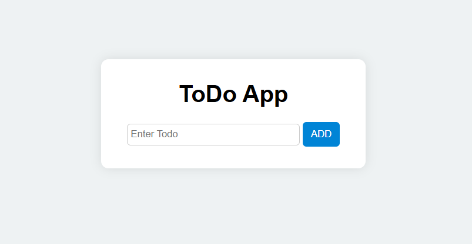

# 📝 To-Do App

A simple **To-Do List application** built using **HTML, CSS, and JavaScript**.  
It allows users to add and delete tasks, making task management easy.

---

## ✨ Features
- Add new tasks  
- Delete tasks with a click  
- User-friendly design with clean UI  
- Alerts if user tries to add an empty task  

---

## 🚀 How to Use
1. Clone or download this repository  
2. Open `index.html` in your browser  
3. Add tasks in the input field and click **ADD**  
4. Remove tasks by clicking the ❌ (close icon)  

---

## 📸 Screenshot

---